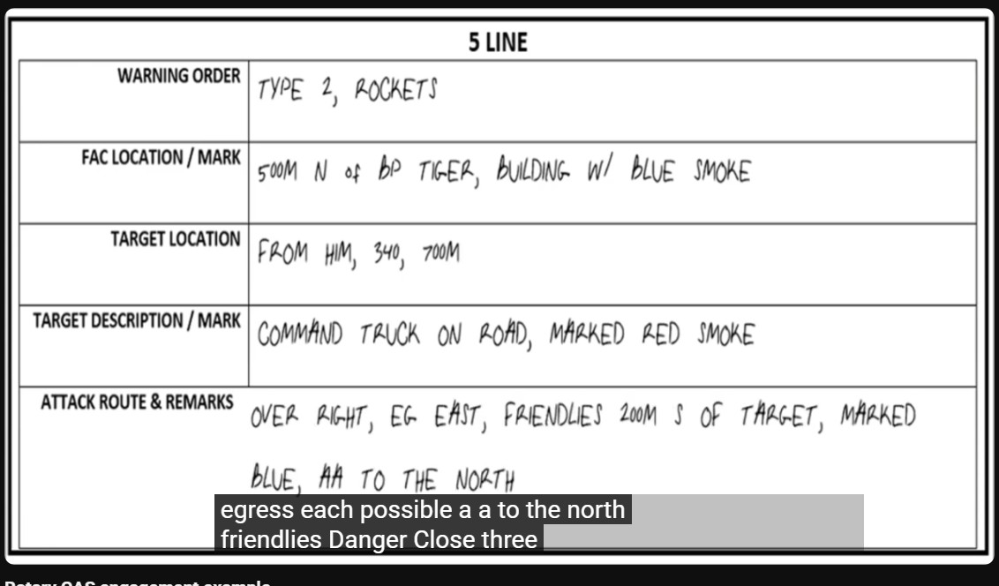

# 5 Liner

5-Liner CAS Brief to skrócona procedura wezwania wsparcia powietrznego, używana, gdy pełny 9-Line jest niepraktyczny ze względu na czas lub gdy atakujący statek powietrzny ma już dobrą świadomość sytuacyjną. Jest to standardowy format używany do kontroli typu 2 i 3, często w trybie "Armed Overwatch", gdy pilot już obserwuje pole walki.

Używaj procedury 5-Liner, gdy:

- Prowadzisz operacje w trybie Armed Overwatch (pilot jest "On Station").
- Wymagana jest szybka reakcja, a pilot już widzi ogólny rejon celu.
- Wzywający (obserwator) i pilot mają wspólny, widoczny punkt odniesienia.

## Skrót

1. Plan Gry (Game Plan / Warning Order)

- Pozycja sił własnych
- Lokalizacja celu
- Opis i oznaczenie celu
- Ograniczenia (Remarks)

## Szczegóły lini

### Linia 1: Plan Gry (Game Plan / Warning Order)

Cel: Poinformowanie pilota o zamiarze przeprowadzenia ataku, podanie jego kryptonimu oraz typu kontroli.
Struktura: "[Twój kryptonim] dla [Kryptonim pilota]. Mam 5-Line, Typ [1, 2 lub 3] kontroli."
Przykład: "Gawron 1, tu Alfa. Mam 5-Line, Typ 2 kontroli."
Wyjaśnienie: To najważniejsza linia, która ustanawia "zasady gry".

Typ kontroli informuje pilota:
Typ 1: musi wizualnie widzieć cel,
Typ 2: może polegać na danych od Ciebie
Typ 3: ma wolną rękę w niszczeniu celów w danym obszarze

### Linia 2: Pozycja sił własnych

Cel: Podanie lokalizacji najbliższych sił sojuszniczych.
Struktura: "Moja pozycja [Grid] oznaczona [metoda]." lub "Najbliżsi sojusznicy [Grid] oznaczeni [metoda]."
Przykład: "Najbliżsi sojusznicy 300 metrów na południe od celu, oznaczeni pomarańczowym dymem."
Wyjaśnienie: Kluczowa informacja dla bezpieczeństwa. Zawsze musi być jasna i precyzyjna.

### Linia 3: Lokalizacja celu

Cel: Precyzyjne wskazanie, gdzie znajduje się cel.
Struktura: "Cel na Grid [Grid]." lub "Cel 200 metrów na północ od [punkt odniesienia]."
Przykład: "Cel na Grid jeden-dwa-trzy-cztery-pięć-sześć."
Wyjaśnienie: Podstawa całego ataku. Musi być dokładna.

### Linia 4: Opis i oznaczenie celu

Cel: Opisanie celu i sposobu jego oznaczenia.
Struktura: "[Opis celu], oznaczony [metoda oznaczenia]."
Przykład: "Jeden czołg T-72, oznaczony wskaźnikiem laserowym, kod 1-6-8-8."
Wyjaśnienie: Mówi pilotowi, czego ma szukać i co zniszczyć.

### Linia 5: Ograniczenia (Remarks)

Cel: Przekazanie wszelkich dodatkowych, krytycznych informacji.
Struktura: "Uwagi: [informacje]."
Przykład: "Uwagi: niebezpieczeństwo Danger Close. Wyjście na północ po ataku."
Wyjaśnienie: Ostatnia szansa na przekazanie kluczowych danych, takich jak kierunek ucieczki, zagrożenia przeciwlotnicze czy potwierdzenie "Danger Close".

## Przykład

Sytuacja: Drużyna "Alfa" jest pod ostrzałem z BTR-a. Śmigłowiec "Gawron 1" jest na pozycji "BP Północ" i obserwuje teren.

> - "Gawron 1, tu Alfa. Mam dla ciebie 5-Line, Typ 2 kontroli."
> - "Najbliżsi sojusznicy znajdują się w lesie, 400 metrów na zachód od celu."
> - "Cel na Grid osiem-siedem-sześć-pięć-cztery-trzy."
> - "Jeden BTR-80 na skrzyżowaniu dróg. Nie oznaczam, cel jest oczywisty."
> - "Uwagi: Wyjście na zachód po ataku."
> - Pilot (potwierdza):
> - "Zrozumiałem. Potwierdzam BTR na skrzyżowaniu, grid 876543. Sojusznicy 400m na zachód. Wyjście na zachód. Jestem na kursie."

## Wnioski

Poprawna procedura 5-Line jest zwięzła, ale zawiera wszystkie krytyczne informacje bojowe, pozwalając na szybkie i skuteczne działanie przy zachowaniu maksymalnego możliwego bezpieczeństwa. Jeszcze raz przepraszam za wcześniejsze wprowadzenie w błąd.

## Filmik

[Youtube](https://www.youtube.com/watch?v=VRnjkj377EE)
