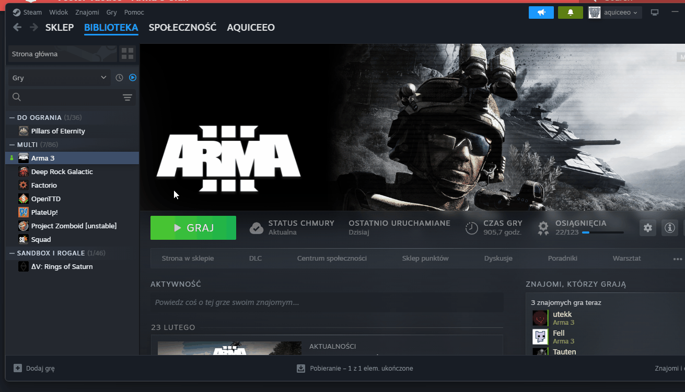
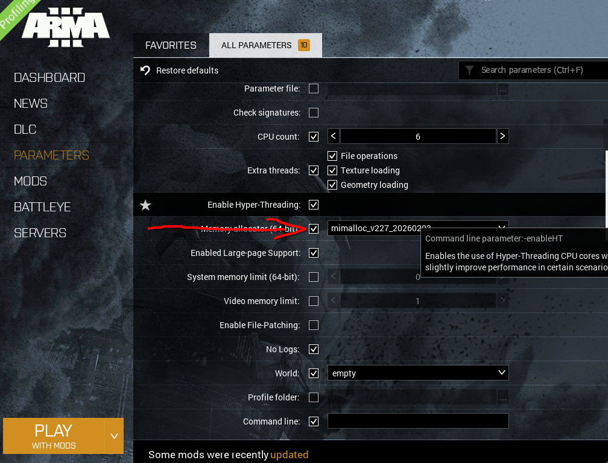
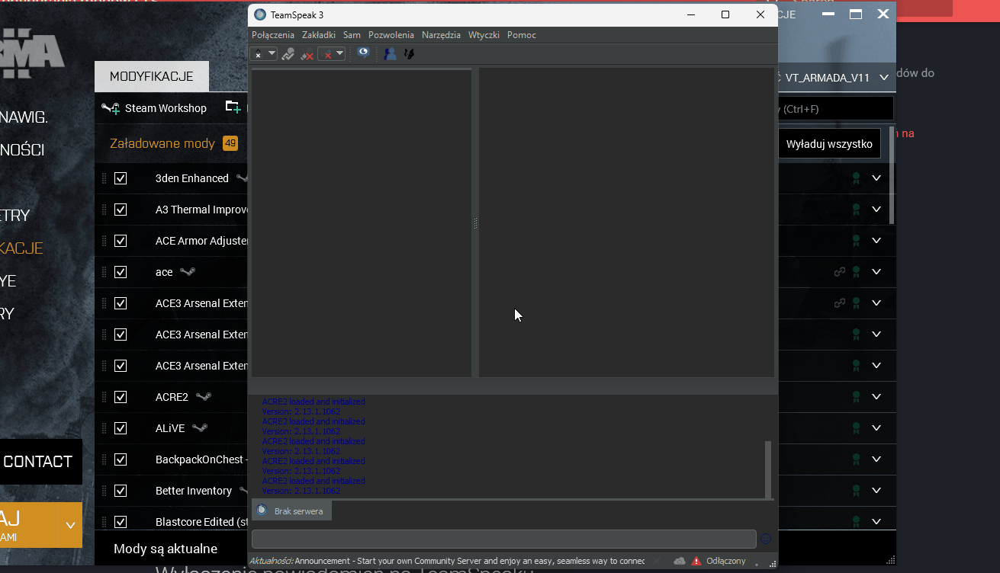
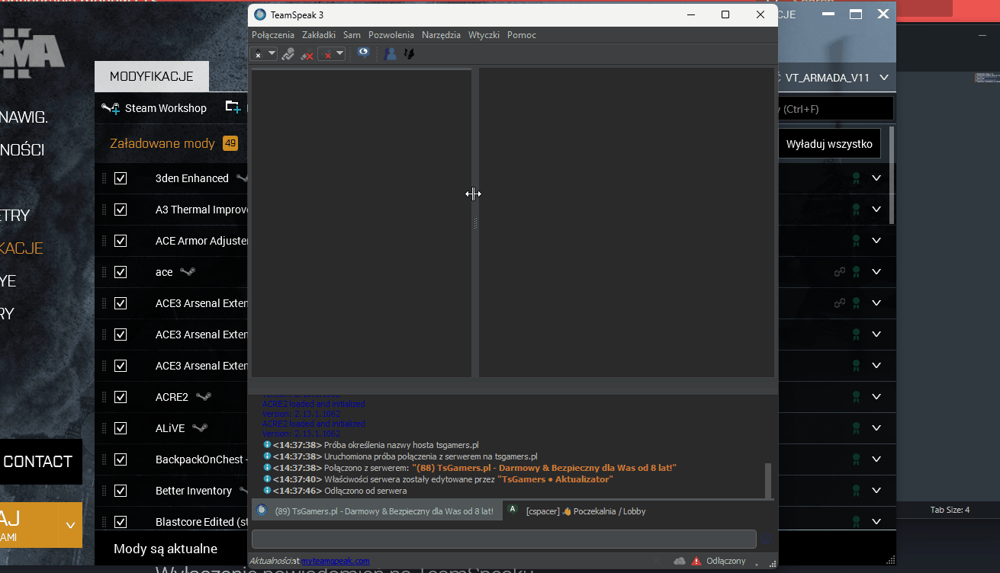

# Konfiguracja i optymalizacja
## Wersja Profiling
  

## Dodatkowe kroki
<iframe width="560" height="315" src="https://www.youtube.com/embed/GktBSZcglFk?si=bH9Qw_PX3Q7Iwaus" title="YouTube video player" frameborder="0" allow="accelerometer; autoplay; clipboard-write; encrypted-media; gyroscope; picture-in-picture; web-share" referrerpolicy="strict-origin-when-cross-origin" allowfullscreen></iframe>  

## Memory alocator

- Pobieramy plik ze strony: <https://github.com/GoldJohnKing/mimalloc/releases/tag/Arma-3-v2.2.7-20260203/>   
- Wrzucamy ten plik \*.dll do katalogu DLL w gównym katalogu ARMY 3.  
- Nastepnie zmieniamy Memory Alocetor na mimaloc  

## Wczytywanie presetu modów do Army
  

## Reset ACRE
  

## Wyłączenie powiadomień na TeamSpeaku
  